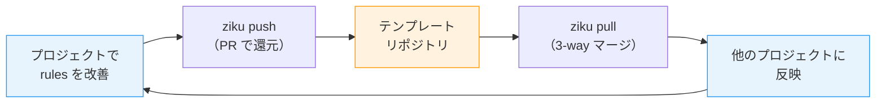

# はじめに

Claude Code の `.claude/rules/` や `.claude/skills/`、ちゃんと全リポジトリで揃えてますか？

自分は最初、手動コピーで頑張っていた。でもリポジトリが増えるにつれて破綻した。あるリポジトリで rules を改善しても、他のリポジトリには反映されない。**テンプレートは作った瞬間から陳腐化が始まる。** この「作って終わり問題」を解決するために、テンプレートとプロジェクトを双方向に同期する CLI ツール **[ziku](https://github.com/tktcorporation/ziku)**（軸）を作った。

```bash
npx ziku
```

プロジェクト側の改善をテンプレートに PR として還元できるのが最大の特徴。`.claude` に限らず `.devcontainer`、GitHub Actions、lint 設定など開発環境テンプレート全般を同期できる。

# なぜ作ったのか

Claude Code を使い込むほど `.claude/` 配下のファイルが育っていく。

```
.claude/
├── settings.json          # MCP サーバー、パーミッション設定
├── rules/
│   ├── code-intent-documentation.md  # WHY コメントルール
│   ├── pr-ci-watch.md                # CI 監視ルール
│   ├── pr-workflow.md                # PR ワークフロー
│   └── pre-push-verification.md      # push 前検証
└── skills/
    ├── autonomous-dev/SKILL.md       # 自律実装スキル
    ├── upstream-fix/SKILL.md         # 根本修正スキル
    └── ui-craft/SKILL.md             # UI 実装スキル
```

これを複数リポジトリで運用していると、こういう状況になりがち。

1. テンプレートから rules / skills をコピーして新リポジトリを作る
2. 開発を進めるうちに「この rule はこう書いた方がいいな」と改善する
3. **その改善はテンプレート本体に反映されない**
4. しばらく経つと、テンプレートは古いまま、各プロジェクトの `.claude/` はそれぞれ独自進化している

結局テンプレートは作った瞬間から陳腐化が始まる。これは `.devcontainer` や CI 設定でも同じ問題が起きる。

ziku はこの問題を、`push` と `pull` の双方向サイクルで解決する。



# 既存の方法との比較

| 方法 | テンプレート→プロジェクト | プロジェクト→テンプレート | 更新の追従 |
|---|---|---|---|
| GitHub Template Repository | 初回コピーのみ | なし | なし |
| `cookiecutter` / `degit` | 初回生成のみ | なし | なし |
| Git Submodule | リアルタイム | 可能だが煩雑（変更の還元手順が多く、`.claude/` のように複数ディレクトリに跨る配置も難しい） | 手動 pull |
| **ziku** | `pull` で継続取得 | `push` で PR or 直接コピー | `diff` で自動検出 |

**どれも「テンプレートからプロジェクトへ」の一方通行。プロジェクト側の改善をテンプレートに還元する仕組みがなかった。**

# こんなときに便利

## 「rules を改善したけど、他のリポジトリにも反映したい」

プロジェクト A で `code-intent-documentation.md` を改善した。同じ rules を使っているプロジェクト B, C にも反映したい。

```bash
# プロジェクト A で改善をテンプレートに還元
npx ziku push -m "code-intent-documentation に初期化値の記述ルールを追加"
```

```
┌   ziku push  v1.0.0
│
◇  Fetching template...
│
◇  Downloading template from GitHub...
│
◇  Detecting changes...
│
◇  Analyzing differences...
│
◇  Files that would be included in PR:
│
│  ~ .claude/rules/code-intent-documentation.md
│
│  ~1 modified
│
◇  PR を作成しました: your-org/.github#12
```

テンプレートリポジトリに PR が作られる。マージされたら、他のプロジェクトで `pull` するだけ。

ローカルテンプレート（`--from-dir`）の場合は PR ではなく直接コピーになる。

```bash
# プロジェクト B, C で最新テンプレートを取り込む
npx ziku pull
```

```
┌   ziku pull  v1.0.0
│
◇  Fetching template...
│
◇  Downloading template from GitHub...
│
◇  Detecting changes...
│
◇  Applying updates...
│
│  ~ .claude/rules/code-intent-documentation.md (3-way merge)
│
│  ~1 modified
│
└  Pull complete!
```

## 「新しい skill を作ったから全リポジトリに配りたい」

テンプレートに新しい skill を追加し、`ziku.jsonc` の `include` にもパターンを追加した。`pull` するとファイルだけでなく **新しいパターンも自動でマージ** される。

```bash
npx ziku diff --verbose
```

```
┌   ziku diff  v1.0.0
│
◇  Fetching template...
│
◇  Downloading template from GitHub...
│
◇  Detecting changes...
│
◇  Analyzing differences...
│
│  + .claude/skills/ui-craft/SKILL.md
│  + .claude/skills/ui-craft/references/component-libraries.md
│
│  +2 added
│
└  Run 'ziku pull' to pull changes.
```

```bash
npx ziku pull    # 新 skill を取り込む
```

3-way マージなので、プロジェクト側で独自に変えた rules は壊されない。コンフリクトが起きたら git と同じ形式のマーカーが出るので、解決して `pull --continue` すればいい。

# 構造化マージ

テンプレート同期で地味に厄介なのが、JSON や TOML のマージ。たとえば `.mcp.json` にテンプレート側とプロジェクト側がそれぞれ別の MCP サーバーを追加した場合、テキストベースの diff だと行の近さでコンフリクトになりがち。

ziku は JSON / JSONC / TOML / YAML をパースして、キー・値レベルで **構造化マージ** する。

```jsonc
// テンプレート側: context7 サーバーを追加
{
  "mcpServers": {
    "chrome-devtools": { "type": "stdio", "command": "..." },
    "context7": { "type": "stdio", "command": "..." }  // ← テンプレートで追加
  }
}
```

```jsonc
// プロジェクト側: sentry サーバーを追加
{
  "mcpServers": {
    "chrome-devtools": { "type": "stdio", "command": "..." },
    "sentry": { "type": "stdio", "command": "..." }  // ← プロジェクトで追加
  }
}
```

```jsonc
// ziku pull 後のマージ結果（コンフリクトなし）
{
  "mcpServers": {
    "chrome-devtools": { "type": "stdio", "command": "..." },
    "context7": { "type": "stdio", "command": "..." },
    "sentry": { "type": "stdio", "command": "..." }
  }
}
```

オブジェクトのキーレベルで差分を検出するので、「両方が別のキーを追加しただけ」という本来衝突すべきでない変更をコンフリクトなしに処理できる。同じキーを両方が変更した場合はローカル側を保持し、テキストマージにフォールバックする。

対応フォーマットは JSON / JSONC（`jsonc-parser`）、TOML（`smol-toml`）、YAML。パースに失敗した場合はテキストベースの 3-way マージにフォールバックするので、未対応のフォーマットでも壊れることはない。

# はじめ方

## 1. テンプレートリポジトリを用意する

Organization（または個人アカウント）に `.github` や `.ziku` という名前のリポジトリを作り、`setup` コマンドで初期化する。

```bash
# テンプレートリポジトリで
npx ziku setup
```

これで `.ziku/ziku.jsonc` が作られる。同期したいファイルパターンを定義する。

自分は `tktcorporation/.github` に、こんな構成でテンプレートを管理している。

```
your-org/.github/
├── .claude/
│   ├── settings.json
│   ├── rules/
│   │   ├── code-intent-documentation.md
│   │   ├── pr-ci-watch.md
│   │   └── pr-workflow.md
│   └── skills/
│       ├── autonomous-dev/SKILL.md
│       └── upstream-fix/SKILL.md
├── .devcontainer/
│   └── devcontainer.json
├── .mcp.json
├── .mise.toml
└── .ziku/
    └── ziku.jsonc    # どのファイルを同期するかの定義
```

`ziku.jsonc` で、どのファイルを同期対象にするかを `include` パターンで定義する。テンプレート側もプロジェクト側も同じ形式。

```jsonc
{
  "$schema": "https://raw.githubusercontent.com/tktcorporation/ziku/main/schema/ziku.json",
  "include": [
    ".claude/settings.json",
    ".claude/rules/*.md",
    ".claude/skills/**",
    ".devcontainer/**",
    ".mcp.json",
    ".mise.toml"
  ]
}
```

リモートのテンプレートリポジトリをセットアップすることもできる。

```bash
# リモートリポジトリに PR で ziku.jsonc を追加
npx ziku setup --remote --from my-org/my-templates
```

## 2. プロジェクトにテンプレートを適用する

```bash
npx ziku --from your-org/.github
```

テンプレートリポジトリを指定すると、ダウンロード → ファイル適用まで自動で進む。`--from` を省略すると git remote の Organization から `.ziku` → `.github` の順で自動検出する。

```
┌   ziku  v1.0.0
│
●  Target: /path/to/my-project
│
●  Template: your-org/.github
│
◇  Fetching template...
│
◇  Downloading template from GitHub...
│
◇  Applying templates...
│
│  + .claude/rules/code-intent-documentation.md
│  + .claude/rules/pr-ci-watch.md
│  + .claude/rules/pr-workflow.md
│  + .claude/skills/autonomous-dev/SKILL.md
│  + .claude/settings.json
│  + .devcontainer/devcontainer.json
│  + .mcp.json
│  + .mise.toml
│  + .ziku/ziku.jsonc
│  + .ziku/lock.json
│
│  10 added
│
└  Setup complete!
```

ローカルのディレクトリをテンプレートとして使うこともできる（GitHub 不要）。

```bash
npx ziku --from-dir ../my-template
```

セットアップが終わったら、あとは `pull` と `push` の繰り返し。

# `.claude` 以外にも使える

ziku はファイルパターンで同期対象を指定するので、`.claude` 以外のテンプレートも同じ仕組みで管理できる。

自分のテンプレートでは以下も一緒に同期している。

- **`.devcontainer/`** ── DevContainer の設定、セットアップスクリプト
- **`.mcp.json`** ── MCP サーバーの設定
- **`.mise.toml`** ── ランタイムバージョン管理
- **`.github/workflows/`** ── GitHub Actions のラベル管理、Issue リンク

# 技術スタック

| カテゴリ | 技術 |
|---|---|
| 言語 | TypeScript (ESM) |
| エラーハンドリング | [Effect](https://effect.website/) (DI パターン) |
| パターンマッチ | [ts-pattern](https://github.com/gvergnaud/ts-pattern) |
| CLI フレームワーク | [citty](https://github.com/unjs/citty) |
| 対話 UI | [@clack/prompts](https://github.com/bombshell-dev/clack) |
| GitHub API | [@octokit/rest](https://github.com/octokit/rest.js) |
| バリデーション | [Zod](https://zod.dev/) v4 (Branded Types) |
| リント / フォーマット | [oxlint](https://oxc.rs/) / [oxfmt](https://oxc.rs/) / [ast-grep](https://ast-grep.github.io/) |

# 設計のこだわり

## Branded Types で「取り違え」を型で防ぐ

ziku はテンプレートのファイル内容とプロジェクトのファイル内容を頻繁にやり取りする。どちらも `string` だが、取り違えるとマージ結果が壊れる。Zod v4 の Branded Types で `BaseContent` / `LocalContent` / `TemplateContent` を型レベルで区別し、コンパイル時に検出できるようにしている。

Effect の DI パターンで外部依存（GitHub API、ファイルシステム）を差し替え可能にし、ts-pattern の exhaustive チェックでマージ戦略のハンドル漏れをコンパイル時に検出している。

# 想定ユーザー

- **Claude Code の rules / skills を複数リポジトリで統一したい人** ── これが一番のユースケース
- **`.devcontainer` や CI 設定も含めて開発環境を揃えたい人** ── テンプレート全体を管理できる
- **Organization でチーム標準テンプレートを運用したい人** ── `push` が PR になるのでレビューも回せる

# おわりに

テンプレートを「作って終わり」にせず、プロジェクトと一緒に育てていけるツールを目指して作った。自分自身の運用では、あるリポジトリで rules を改善したら `push` でテンプレートに還元し、他のリポジトリで `pull` で取り込むサイクルを日常的に回している。

v1.0.0 をリリースしたばかりだが、自分の日常開発では既に欠かせないツールになっている。興味があればぜひ触ってみてほしい。Issue や PR も歓迎です。

https://github.com/tktcorporation/ziku

```bash
npx ziku
```
