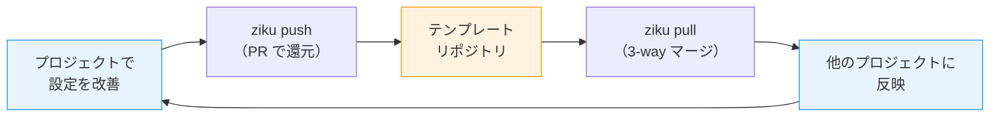

# ziku とは？

ziku（軸）は、`.claude/`や`.mcp.json`といった設定フォルダ/ファイルを複数リポジトリ間で双方向に同期する CLI ツールです。

```bash
npx ziku
```

主な特徴は

- `push` でプロジェクトの改善をテンプレートに PR として還元し、`pull` で最新を取り込める
- ファイルパターンで同期対象を指定。`.claude/rules/` やルート直下の `.mcp.json` など散らばったファイルもまとめて管理できる
- git ライクな操作感

他のテンプレート管理方法との比較

| 方法 | テンプレート→プロジェクト | プロジェクト→テンプレート | 柔軟性 |
|---|---|---|---|
| GitHub Template Repository | 初回コピーのみ | なし | — |
| Git Submodule | `pull` | `push` | サブモジュールのディレクトリ以下のみ |
| **ziku** | `pull` | `push` | どのディレクトリでも適用可 |

# 何を解決するか

Claude Code などの Coding Agent で利用する `.claude/settings.json`、rules、skills、`.mcp.json` 等の設定がプロジェクト間で乖離しがち問題を解決します。
`npx ziku` のみで動く手軽さで、高頻度のリポジトリ作成/切り替え、Skill作成でもストレスなく双方向同期が可能になり、テンプレートの陳腐化を防ぎます。

```
.claude/
├── settings.json
├── rules/
│   └── pr-workflow.md
└── skills/
    └── ui-craft/SKILL.md
.mcp.json
.mise.toml  # このあたりも使いまわしたり
```




# 基本操作

## テンプレートリポジトリの初期化（setup）

任意のOrganizationに`.github` や `.ziku` の名前でリポジトリを作り、`setup` で初期化します。
(自動解決先をこの名前にしていますが、どのリポジトリでも指定可能です)

```bash
npx ziku setup
```

`.ziku/ziku.jsonc` ができるので、同期対象のファイルパターンを書きます。

```jsonc
{
  "$schema": "https://raw.githubusercontent.com/tktcorporation/ziku/main/schema/ziku.json",
  "include": [
    ".claude/settings.json",
    ".claude/rules/*.md",
    ".claude/skills/**",
    ".devcontainer/**",
    ".mcp.json",
    ".mise.toml"
  ]
}
```

## プロジェクトへの適用（init）

```bash
npx ziku init # `.github` `.ziku` が存在すれば自動解決
```

## 改善をテンプレートに還元する（push）

プロジェクトで設定を改善したら `push` でテンプレートに戻します。

```bash
npx ziku push -m "pr-workflow に CI ウォッチの手順を追加"
```

```
┌   ziku push  v1.0.2
│
◇  Detecting changes...
│
◇  Analyzing differences...
│
◇  Files that would be included in PR:
│
│  ~ .claude/rules/pr-workflow.md
│
│  ~1 modified
│
◇  Created PR: your-org/.github#12
```

テンプレートリポジトリに PR が作られます。マージしたら、他のプロジェクトで `pull` して取り込めます。

## テンプレートの最新を取り込む（pull）

```bash
npx ziku pull
```

```
┌   ziku pull  v1.0.2
│
◇  Detecting changes...
│
◇  Applying updates...
│
│  ~ .claude/rules/pr-workflow.md (3-way merge)
│
│  ~1 modified
│
└  Pull complete!
```

3-way マージなので、プロジェクト側で独自に変えた部分はそのまま残ります。コンフリクトが起きたら git と同じマーカーが出るので、解決して `pull --continue` で続行できます。

## 差分の確認（diff）

```bash
npx ziku diff
```

同期対象の差分に加えて、まだ同期対象に入っていないファイルも教えてくれます。

```
┌   ziku diff  v1.0.2
│
◇  Detecting changes...
│
◆  Tracked files are in sync.
│
▲  However, 2 untracked file(s) exist outside the sync whitelist:
│
│    • .claude/skills/ui-design-research/SKILL.md
│    • .claude/skills/ui-design-research/references/design-patterns.md
│
●  Use npx ziku track <pattern> to add them, then push to sync.
│
└  Tracked files are in sync, but untracked files exist.
```

## 同期対象の追加（track）

新しく作ったファイルを同期対象に入れたいときは `track` を使います。

```bash
npx ziku track '.claude/skills/ui-design-research/**'
```

追加したら `push` すればテンプレートに反映されます。他のプロジェクトで `pull` すると、ファイルと一緒に新しいパターンもマージされます。

# おわりに

設定を改善したら `push` で還元し、別のプロジェクトでは `pull` で取り込む。
`npx ziku` と短いtypeで使えるのも手軽で、手元で便利に使っています。よければ使ってみていただければと。

https://github.com/tktcorporation/ziku

```bash
npx ziku
```
