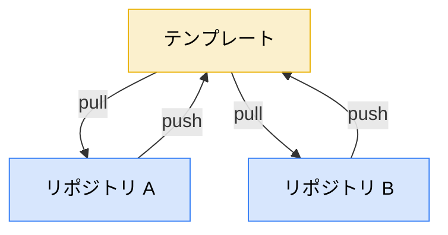
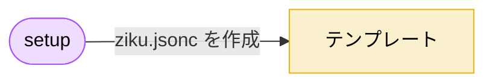
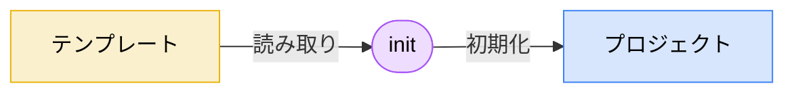
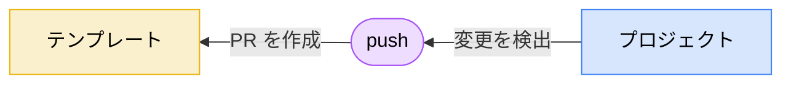
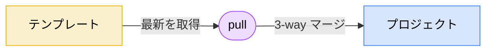
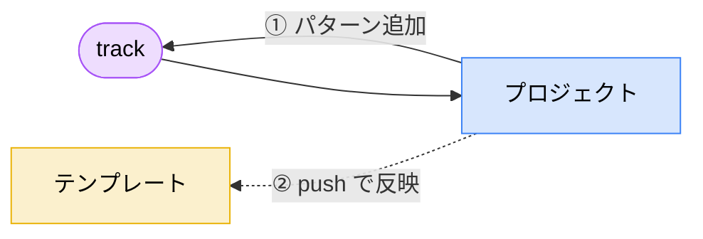

## ziku とは？


ziku（軸）は、`.claude/`や`.mcp.json`といった設定フォルダ/ファイルを複数リポジトリ間で双方向に同期する CLI ツールです。

```bash
$ npx ziku --help

Dev environment template manager (ziku v1.0.2)

USAGE ziku init|setup|push|pull|diff|track

COMMANDS

   init    Apply dev environment template to your project
  setup    Initialize a template repository with .ziku/ziku.jsonc
   push    Push local changes to the template (PR for GitHub, direct copy for local)
   pull    Pull latest template updates
   diff    Show differences between local and template
  track    Add file patterns to the tracking whitelist in ziku.jsonc 

Use ziku <command> --help for more information about a command.
```

主な特徴は

- `push` でプロジェクトの改善をテンプレートに PR として還元し、`pull` で最新を取り込める
- ファイルパターンで同期対象を指定。`.claude/rules/` やルート直下の `.mcp.json` など散らばったファイルもまとめて管理できる
- git ライクな操作感

他のテンプレート管理方法との比較

| 方法 | テンプレート→プロジェクト | プロジェクト→テンプレート | 柔軟性 |
|---|---|---|---|
| GitHub Template Repository | 初回コピーのみ | なし | — |
| Git Submodule | `pull` | `push` | サブモジュールのディレクトリ以下のみ |
| **ziku** | `pull` | `push` | どのディレクトリでも適用可 |

## 何を解決するか

Claude Code などの Coding Agent で利用する `.claude/settings.json`、rules、skills、`.mcp.json` 等の設定がプロジェクト間で乖離しがち問題を解決します。
`npx ziku` のみで動く手軽さで、高頻度のリポジトリ作成/切り替え、Skill作成でもストレスなく双方向同期が可能になり、テンプレートの陳腐化を防ぎます。

```
.claude/
├── settings.json
├── rules/
│   └── pr-workflow.md
└── skills/
    └── ui-craft/SKILL.md
.mcp.json
.mise.toml  # このあたりも使いまわしたり
```



## 基本操作

### テンプレートリポジトリの初期化（setup）

任意のOrganizationに`.github` や `.ziku` の名前でリポジトリを作り、`setup` で初期化します。
(自動解決先をこの名前にしていますが、どのリポジトリでも指定可能です)



```bash
npx ziku setup
```

`.ziku/ziku.jsonc` ができるので、同期対象のファイルパターンを書きます。

```jsonc
{
  "$schema": "https://raw.githubusercontent.com/tktcorporation/ziku/main/schema/ziku.json",
  "include": [
    ".claude/settings.json",
    ".claude/rules/*.md",
    ".claude/skills/**",
    ".devcontainer/**",
    ".mcp.json",
    ".mise.toml"
  ]
}
```

### プロジェクトへの適用（init）



```bash
npx ziku init # `.github` `.ziku` が存在すれば自動解決
```

```bash
┌   ziku  v1.0.2
│
●  Target: /path/to/my-project
│
●  Template: your-org/.github
│
●  Selected 3 directories
│
◇  Applying templates...
│
│  + .claude/rules/pr-workflow.md
│  + .claude/skills/ui-craft/SKILL.md
│  + .mcp.json
│  + .ziku/ziku.jsonc
│  + .ziku/lock.json
│
│  5 added
│
└  Setup complete!
```

### 改善をテンプレートに還元する（push）

プロジェクトで設定を改善したら `push` でテンプレートに戻します。



```bash
npx ziku push -m "pr-workflow に CI ウォッチの手順を追加"
```

```bash
┌   ziku push  v1.0.2
│
◇  Detecting changes...
│
◇  Analyzing differences...
│
◇  Files that would be included in PR:
│
│  ~ .claude/rules/pr-workflow.md
│
│  ~1 modified
│
◇  Created PR: your-org/.github#12
```

テンプレートリポジトリに PR が作られます。マージしたら、他のプロジェクトで `pull` して取り込めます。

### テンプレートの最新を取り込む（pull）



```bash
npx ziku pull
```

```bash
┌   ziku pull  v1.0.2
│
◇  Detecting changes...
│
◇  Applying updates...
│
│  ~ .claude/rules/pr-workflow.md (3-way merge)
│
│  ~1 modified
│
└  Pull complete!
```

3-way マージなので、プロジェクト側で独自に変えた部分はそのまま残ります。コンフリクトが起きたら git と同じマーカーが出るので、解決して `pull --continue` で続行できます。

### 差分の確認（diff）

```bash
npx ziku diff
```

同期対象の差分に加えて、まだ同期対象に入っていないファイルも表示。

```bash
┌   ziku diff  v1.0.2
│
◇  Detecting changes...
│
◆  Tracked files are in sync.
│
▲  However, 2 untracked file(s) exist outside the sync whitelist:
│
│    • .claude/skills/ui-design-research/SKILL.md
│    • .claude/skills/ui-design-research/references/design-patterns.md
│
●  Use npx ziku track <pattern> to add them, then push to sync.
│
└  Tracked files are in sync, but untracked files exist.
```

### 同期対象の追加（track）

新しく作ったファイルを同期対象に入れたいときは `track` を使います。



```bash
npx ziku track '.claude/skills/ui-design-research/**'
```

```bash
┌   ziku track  v1.0.2
│
◆  Patterns added!
│
│  Added:
│    + .claude/skills/ui-design-research/**
│
└  Updated .ziku/ziku.jsonc
```

追加したら `push` すればテンプレートに反映されます。他のプロジェクトで `pull` すると、ファイルと一緒に新しいパターンもマージされます。

## おわりに

設定を改善したら `push` で還元し、別のプロジェクトでは `pull` で取り込む。
`npx ziku` と短いtypeで使えるのも手軽で、手元で便利に使っています。

気になる点、バグ等あればリポジトリまでお願いいたします。

https://github.com/tktcorporation/ziku

```bash
npx ziku
```
