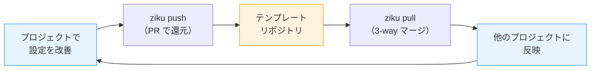

# はじめに

Claude Code を使い込むほど、`settings.json`、rules、skills、`.mcp.json`、`.mise.toml` と、プロジェクトに置く設定ファイルが増えていく。

自分は複数 PC や Claude Code Web で作業するので、設定はプロジェクトスコープに置いている。Git で diff が見えるし、どのプロジェクトでも同じ設定で作業できる。ただ、プロジェクトが増えると問題が出てくる。あるプロジェクトで「この rule の方がいいな」と改善したとき、他のプロジェクトにも持っていきたくなる。手動コピーで頑張っていたけど、すぐに「あれ、これどこまで反映されてたっけ？」がわからなくなった。

**テンプレートは作った瞬間から陳腐化が始まる。** この「作って終わり問題」を解決するために、テンプレートとプロジェクトを双方向に同期する CLI ツール **[ziku](https://github.com/tktcorporation/ziku)**（軸）を作った。

```bash
npx ziku
```

プロジェクト側の改善を `push` でテンプレートに PR として還元し、他のプロジェクトで `pull` で取り込む。このサイクルを回すとテンプレートが自動的に最新の状態に保たれて、各プロジェクトごとの設定の差をあまり気にせず触れるようになる。

# なぜ作ったのか

Claude Code を使い込むほど `.claude/` 配下のファイルが育っていく。

```
.claude/
├── settings.json       # パーミッション設定、プラグイン
├── rules/
│   └── pr-workflow.md   # PR ワークフロー
└── skills/
    └── ui-craft/SKILL.md  # UI 実装スキル
```

`.claude/` だけじゃなく、`.mcp.json`（MCP サーバー設定）や `.mise.toml`（ランタイムバージョン管理）、`.devcontainer/` なども、プロジェクトをまたいで使い回したい設定だ。

これを複数リポジトリで運用していると、こういう状況になりがち。

1. テンプレートから rules / skills をコピーして新リポジトリを作る
2. 開発を進めるうちに「この rule はこう書いた方がいいな」と改善する
3. **その改善はテンプレート本体に反映されない**
4. しばらく経つと、テンプレートは古いまま、各プロジェクトの設定はそれぞれ独自進化している

新しく便利なプラグインが追加されたからテンプレートに持っていきたい、この lint 設定あっちのリポジトリにもあった方がいい、みたいなことが日常的に起きる。でもテンプレートに手動で反映する仕組みがない。

ziku（軸）はこの問題を、`push` と `pull` の双方向サイクルで解決する。テンプレートを「軸」として、すべてのプロジェクトがその上に成り立ち、改善が軸に戻っていく。



# 既存の方法との比較

| 方法 | テンプレート→プロジェクト | プロジェクト→テンプレート | 柔軟性 |
|---|---|---|---|
| GitHub Template Repository | 初回コピーのみ | なし | — |
| Git Submodule | リアルタイム | 可能だが煩雑 | サブモジュールのディレクトリ以下のみ |
| **ziku** | `pull` で継続取得 | `push` で PR | ルート・深い階層どこでも適用可 |

**どれも「テンプレートからプロジェクトへ」の一方通行。プロジェクト側の改善をテンプレートに還元する仕組みがなかった。**

Git Submodule は双方向のやり取りも一応できるが、サブモジュールのディレクトリ以下にしかファイルを置けない。`.claude/rules/` と `.mcp.json`（プロジェクトルート）と `.devcontainer/` のように、複数のディレクトリに跨る設定を1つのテンプレートとして管理するのが難しい。ziku はファイルパターンで同期対象を指定するので、プロジェクト内のどこにあるファイルでも柔軟に扱える。

# こんなときに便利

## 「rules を改善したけど、他のリポジトリにも反映したい」

プロジェクト A で `pr-workflow.md` を改善した。同じ rules を使っているプロジェクト B, C にも反映したい。

```bash
# プロジェクト A で改善をテンプレートに還元
npx ziku push -m "pr-workflow に CI ウォッチの手順を追加"
```

```
┌   ziku push  v1.0.2
│
◇  Detecting changes...
│
◇  Analyzing differences...
│
◇  Files that would be included in PR:
│
│  ~ .claude/rules/pr-workflow.md
│
│  ~1 modified
│
◇  PR を作成しました: your-org/.github#12
```

テンプレートリポジトリに PR が作られる。マージされたら、他のプロジェクトで `pull` するだけ。

```bash
# プロジェクト B, C で最新テンプレートを取り込む
npx ziku pull
```

```
┌   ziku pull  v1.0.2
│
◇  Detecting changes...
│
◇  Applying updates...
│
│  ~ .claude/rules/pr-workflow.md (3-way merge)
│
│  ~1 modified
│
└  Pull complete!
```

3-way マージなので、プロジェクト側で独自に変えた部分は壊されない。コンフリクトが起きたら git と同じ形式のマーカーが出るので、解決して `pull --continue` すればいい。

## 「新しい skill を全リポジトリに配りたい」

プロジェクトで新しい skill を作った。これをテンプレートにも追加して、他のプロジェクトにも配りたい。

`diff` を実行すると、同期対象の差分だけでなく、**同期対象外のファイル**も検出して `track` を案内してくれる。

```bash
npx ziku diff
```

```
┌   ziku diff  v1.0.2
│
◇  Detecting changes...
│
◆  Tracked files are in sync.
│
▲  However, 2 untracked file(s) exist outside the sync whitelist:
│
│    • .claude/skills/ui-design-research/SKILL.md
│    • .claude/skills/ui-design-research/references/design-patterns.md
│
●  Use npx ziku track <pattern> to add them, then push to sync.
│
└  Tracked files are in sync, but untracked files exist.
```

`track` で同期対象に追加してから `push` すれば、テンプレートにもパターンごと反映される。

```bash
npx ziku track '.claude/skills/ui-design-research/**'
npx ziku push -m "ui-design-research skill を追加"
```

他のプロジェクトで `pull` すると、ファイルだけでなく **新しいパターンも自動でマージ** される。

## 「チームで標準テンプレートを運用したい」

Organization に `.github` リポジトリを作り、チーム共通のテンプレートとして管理する。各メンバーがプロジェクトで改善した設定を `push` すると PR になるので、チームでレビューしてからマージできる。テンプレートの変更が野良コピーにならず、レビューを通じてチーム全体の設定が育っていく。

# はじめ方

## 1. テンプレートリポジトリを用意する

Organization（または個人アカウント）に `.github` や `.ziku` というリポジトリを作り、`setup` コマンドで初期化する。

```bash
npx ziku setup
```

`.ziku/ziku.jsonc` が作られるので、同期したいファイルパターンを定義する。

```jsonc
{
  "$schema": "https://raw.githubusercontent.com/tktcorporation/ziku/main/schema/ziku.json",
  "include": [
    ".claude/settings.json",
    ".claude/rules/*.md",
    ".claude/skills/**",
    ".devcontainer/**",
    ".mcp.json",
    ".mise.toml"
  ]
}
```

## 2. プロジェクトにテンプレートを適用する

```bash
npx ziku --from your-org/.github
```

`--from` を省略すると git remote の Organization から自動検出する。ローカルディレクトリをテンプレートにすることもできる（`--from-dir`）。

セットアップが終わったら、あとは `pull` と `push` の繰り返し。他のプロジェクトで作業を始めるときに `pull` してから始めると、自動的にテンプレートの最新状態で同期された状態からスタートできる。

# おわりに

テンプレートを「作って終わり」にせず、プロジェクトと一緒に育てていけるツールを目指して作った。プロジェクトで設定を改善したら `track` → `push` でテンプレートに還元し、他のプロジェクトで `pull` で取り込む。このサイクルが回り始めるとテンプレートが生きた資産になって、各プロジェクトの設定差分をあまり気にせず快適に開発できるようになる。

https://github.com/tktcorporation/ziku

```bash
npx ziku
```
